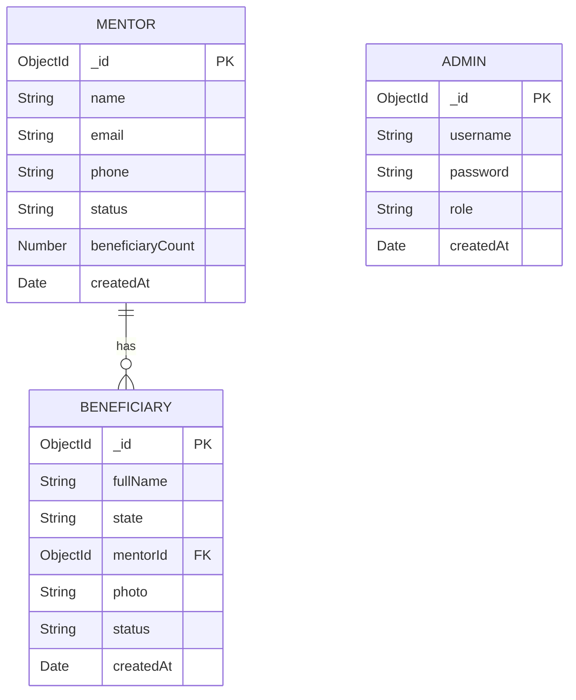

# Entity-Relationship (ER) Diagram Description

## Entities and Attributes

### 1. Admin
- **username** (String)
- **password** (String)
- **role** (String)
- **createdAt** (Date)

### 2. Mentor
- **_id** (ObjectId, Primary Key)
- **name** (String)
- **email** (String)
- **phone** (String)
- **status** (String)
- **beneficiaryCount** (Number)
- **createdAt** (Date)

### 3. Beneficiary
- **_id** (ObjectId, Primary Key)
- **fullName** (String)
- **state** (String)
- **mentorId** (ObjectId, Foreign Key -> Mentor._id)
- **photo** (String)
- **status** (String)
- **createdAt** (Date)

## Relationships

- **Mentor to Beneficiary (1:N)**
  - A single Mentor can be assigned to multiple Beneficiaries (One-to-Many).
  - This relationship is established via the `mentorId` field in the Beneficiary collection, which references the `_id` of the Mentor collection.

